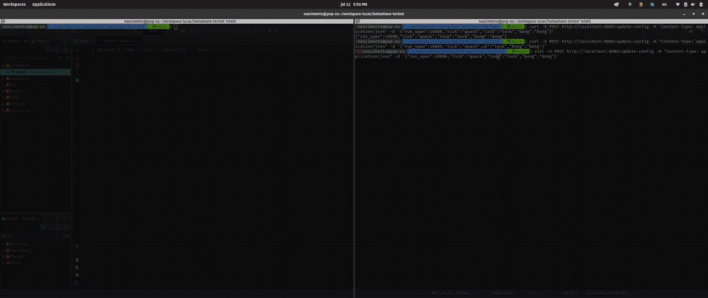

# BallastLane TechTest Project

### Running Solution ###



## Thought process during the exercise

I started this challenge by solving the problem with a preliminar solution. As requested by the *Technical Interview Exercise* the problem can be broken into the follow parts:

1. **Clock applicaton**: Each secound we should print into the output the words: tick (each second), tock (each minute) and bong (each hour).
2. **Configuration mechanism**: Any time with the application running the user should be able to change the print values for any value they want to.
3. **Save the trigged signals on DB**: Each signal trigged by the clock should be saved into a Database.
4. **Dockerized development environment**: Create docker files to support the developement and test process.

# Code Presentation #

### Clock applicaton ###

***Where this code lives***: [`./pkg/clock/clock.go`](./pkg/clock/clock.go). In the `package clock` you will see how I implemented the solution, I decide use the [time.Ticker](https://pkg.go.dev/time#Ticker) that provides a Channel that deliverys "ticks" based on the clock intervals. This was done on [clock.go:46](./pkg/clock/clock.go#L46). Then you can follow next bellow lines checking how I managed the logic to interpret the sinal.

***Challenges on this code***: I had two decisions to take. First calculate the now, based on the seconds recived on the channel, I solved it doing the calculation [clock.go:53](./pkg/clock/clock.go#L53). Second, I was not able to use os.Exit direct because test, it breaks the test cases, so I had to create an Interface and Mock it on the test.

### Configuration mechanism ###

***Where this code lives***: [`./pkg/config/config.go`](./pkg/config/config.go). In the `package config` I implemented two ways to read application settings.
* **Load cofiguration file**: Loading a configuration file passed as parameter on the application startup. [config.go#L35](./pkg/config/config.go#L35)
* **API Endpoint**: ApiEndpoint that changes the values of the configuration loaded. [config.go#L49](./pkg/config/config.go#L49)

### Save the trigged signals on DB ###

***Where this code lives***: [`./pkg/repository/signal.go`](./pkg/repository/signal.go) this is a pretty regular repository implementation with postgres insert implementation. And [`./pkg/db/db.go`](./pkg/db/db.go) another pretty standart way to connect over databases.

### Dockerized development environment ###

***Where this code lives***: [`./Dockerfile`](./Dockerfile) docker image descriptor thats uses two stages compilation, first one to build the executable and the second one that embeeds the executable into a lightweight alpine container image. [`./docker-compose.yml`](./docker-compose.yml) local enviroment to run the soluton and validate the approach.


### Cmd Entry Point ###

***Where this code lives***: [`./cmd/clock/main.go`](./cmd/clock/main.go#L56) In this code we have the entry point accountable to load all the dependencies and inject them into the code to run the solution.

## Running the solution

* **Install Dependencies**: `make deps`
* **Run the solution**: `make run`
* **To change the print tick, tock and bong values**:
```shell
curl -X POST http://localhost:8080/update-config \
-H "Content-Type: application/json" \
-d '{"run_span":10800,"tick":"quack","tock":"quock","bong":"quong"}'
```